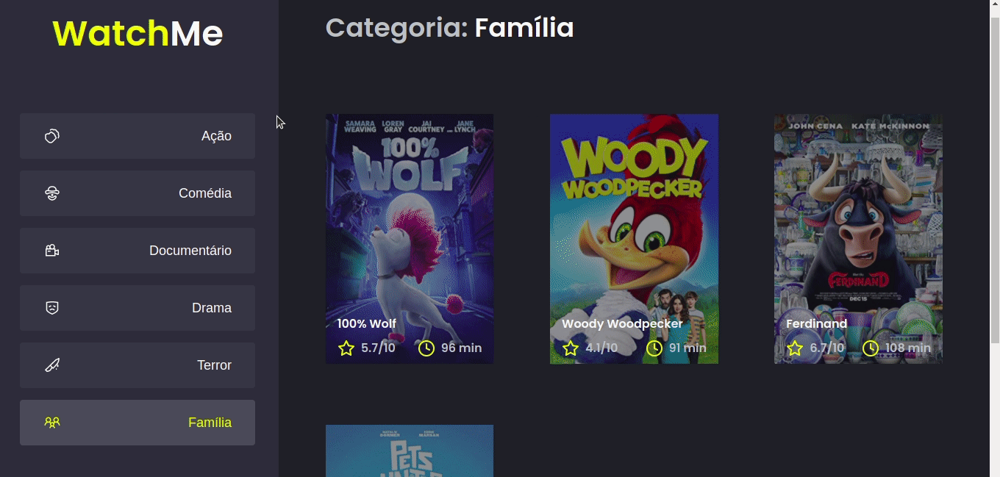

# Desafio 02 - Componentizando a aplicação

## Objetivo

Refatoração de uma aplicação de listagem de filmes de acordo com o gênero selecionado pelo usuário. A aplicação já é funcional, porém a maior parte do código está em `App.tsx` e isso não é uma boa prática.

:heavy_check_mark: Dividir a aplicação em **no mínimo** dois componentes

Esse projeto foi criado através do template [
ignite-template-componentizando-a-aplicacao
](https://github.com/rocketseat-education/ignite-template-componentizando-a-aplicacao)

## Resultados

<div align="center">
    
</div>
<br><br>

`App.tsx` foi refatorada através da criação de dois novos componentes: `Content` e `SideBar`. 

Para fazer com que o gênero selecionado em `SideBar` reflita em `Content`, `App.tsx` ficou responsável por monitorar, através dos hooks do React, o id do gênero selecionado atual e as informações relacionadas a ele. 

* [App.tsx antes](https://github.com/rocketseat-education/ignite-template-componentizando-a-aplicacao/blob/main/src/App.tsx)
* Agora: 
``` typescript
/* 

...importações

*/

// interface utilizada para tipar os gêneros de filmes
interface GenreResponseProps {
  id: number;
  name: "action" | "comedy" | "documentary" | "drama" | "horror" | "family";
  title: string;
}

export function App() {
  // monitoramento do gênero selecionado utilizando useState e useEffect
  const [selectedGenreId, setSelectedGenreId] = useState(1);

  const [selectedGenre, setSelectedGenre] = useState<GenreResponseProps>(
    {} as GenreResponseProps
  );

  useEffect(() => {
    api
      .get<GenreResponseProps>(`genres/${selectedGenreId}`)
      .then((response) => {
        setSelectedGenre(response.data);
      });
  }, [selectedGenreId]);

  function handleClickButton(id: number) {
    setSelectedGenreId(id);
  }

// uso dos componentes criados
return (
    <div style={{ display: "flex", flexDirection: "row" }}>
      <SideBar
        selectedGenreId={selectedGenreId}
        handleClickButton={handleClickButton}
      />
      <Content
        selectedGenre={selectedGenre}
        selectedGenreId={selectedGenreId}
      />
    </div>
  );

```

## Como rodar o projeto?

1. Faça download do projeto
2. Entre no diretório do projeto pelo terminal
3. Rode os comandos `yarn` e `yarn server` em um terminal para rodar a fake api
3. Rode o comando `yarn dev` em outro terminal para rodar o front da aplicação
4. Acesse http://localhost:8080/ 

<hr>

<div align="center">
    Made with ☕ & &#128156; by <strong>Eirene</strong>
</div>


